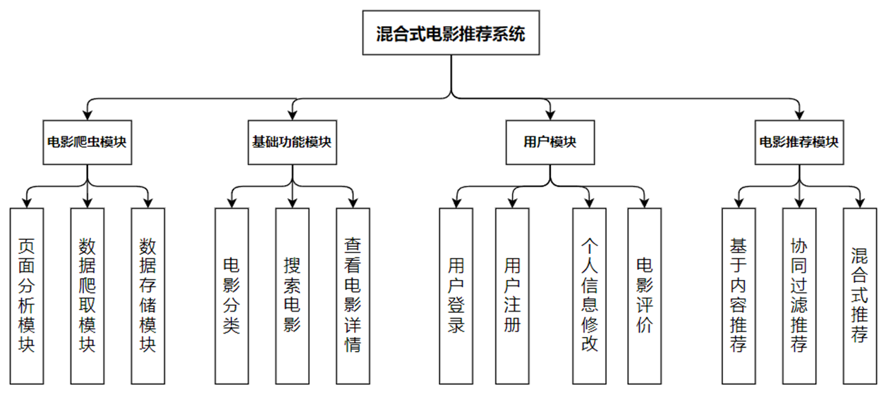
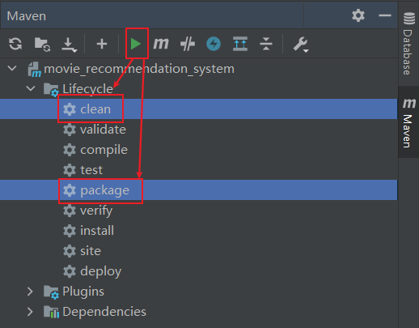

# 电影推荐系统（后端）

## Star History

## 前言

总项目名称：`电影推荐系统`

项目采用`前后端分离`：

1. 前端：
   - 仓库地址：[movie_recommendation_system_vue](https://github.com/jun-wei-zeng/movie_recommendation_system_vue)
   - 技术栈：`Vue3` + `Element Plus` + `axios`等
2. 后端：
   - 仓库地址：[movie_recommendation_system_server](https://github.com/jun-wei-zeng/movie_recommendation_system_server)
   - 技术栈：`Spring Boot` + `Spring Security` + `Redis` + `MyBatis-Plus`等
3. 数据爬虫：
   - 简介：爬取项目所需的电影基本信息数据和用户评价数据等并存储。
   - 仓库地址：[douban_movie_spider_mrs](https://github.com/jun-wei-zeng/douban_movie_spider_mrs/tree/master)
   - 技术栈：`requests` + `lxml`

系统功能模块总览：

## 1. 项目打包部署

### 1.1 项目打包

IDEA右边栏中选择`Maven` → 按住`Ctrl` → 选择`Lifecycle`下的`clean`和`package` → 点击上方的`绿色运行按钮` → 等待项目打包成jar包 → 打包好的jar包会在项目的`target`目录中

### 1.2 项目部署

1. 将打包好的`项目jar包`上传到自己的服务器上。

2. 通过以下命令时项目在服务器后台运行，并且输出日志到`out.txt`文件（可修改）：
    
    >nohup java -jar 项目名.jar >out.txt &

## 2. 后端功能实现

1. 用户登录、注册、个人信息修改等接口实现。
2. 基于内容推荐和基于用户协同过滤推荐等推荐算法实现，整合两种算法实现混合式推荐，并解决冷启动问题。
3. 查询各种电影信息接口实现（如电影搜索、推荐给用户的电影信息查询等）。
4. 用户点赞功接口实现（点赞信息暂存，再按时持久化到数据库）。
5. ...
